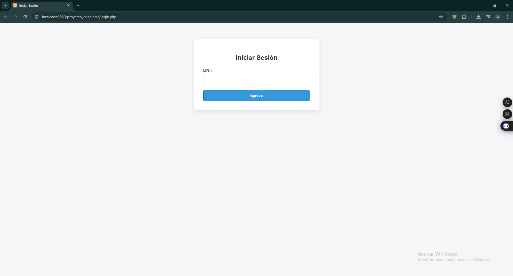
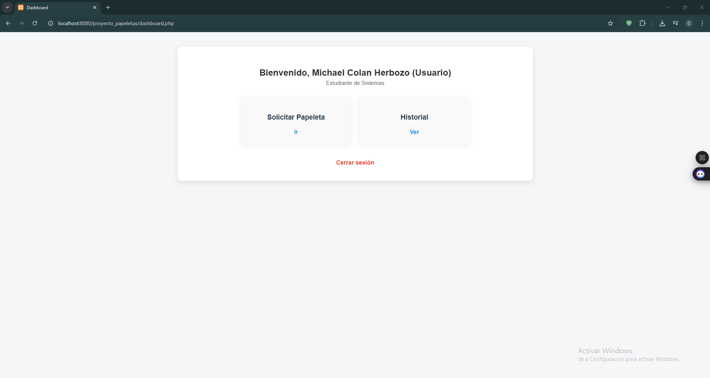
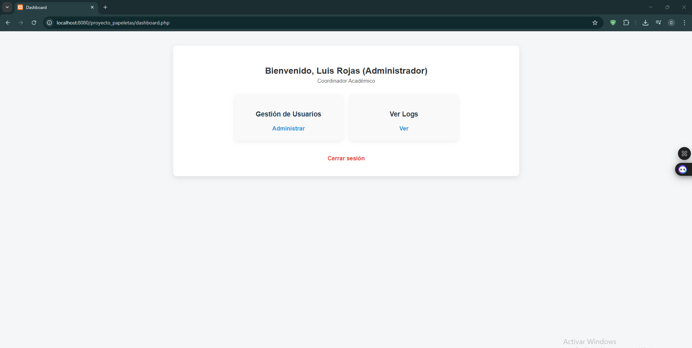
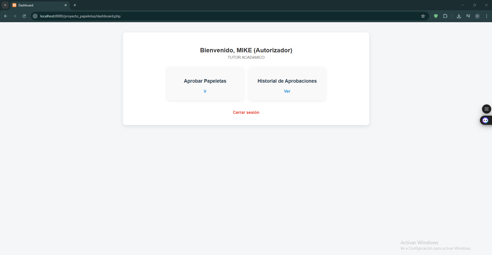
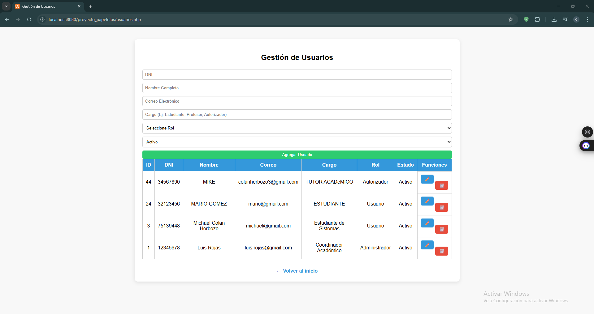
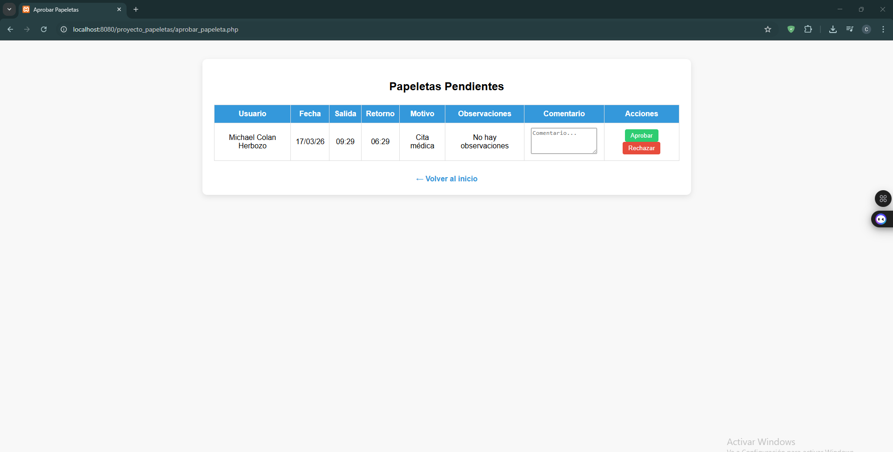
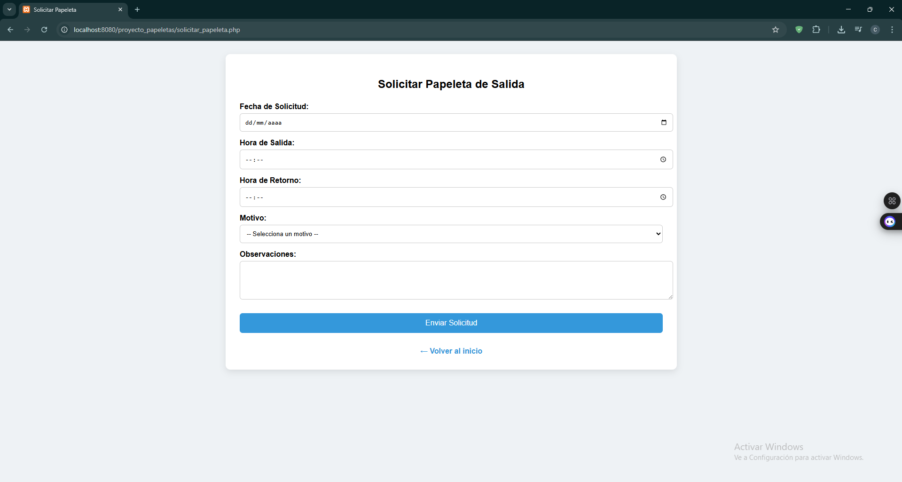
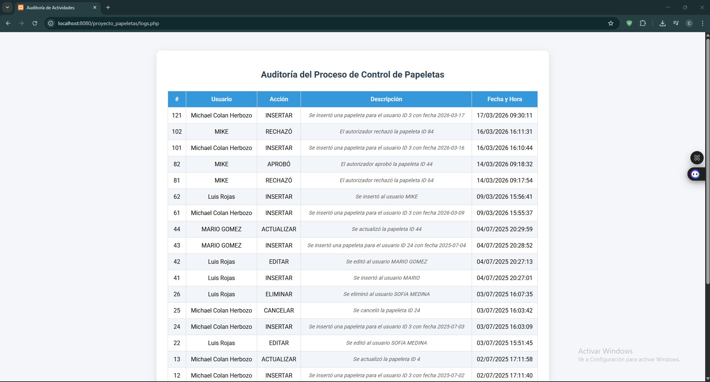
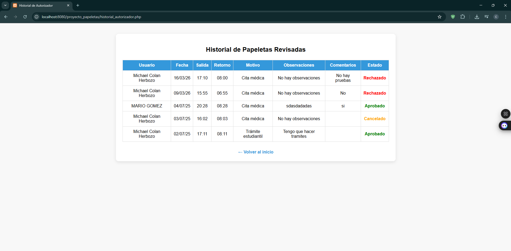
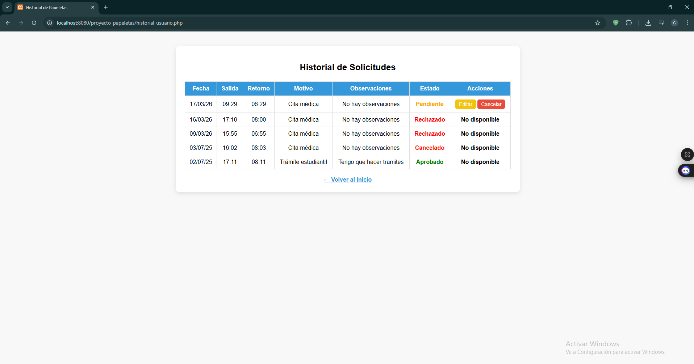

# Sistema de Control de Papeletas de Salida

## Descripción

Sistema web para la gestión de solicitudes de salida de estudiantes. Permite registrar, aprobar y dar seguimiento a cada solicitud mediante control de roles, asegurando trazabilidad del proceso.

## Funcionalidades

* Registro de papeletas de salida
* Aprobación y rechazo de solicitudes
* Control de acceso por roles
* Historial de solicitudes
* Auditoría mediante triggers

## Tecnologías

* HTML
* CSS
* JavaScript
* PHP
* Oracle Database

## Desarrollo

* Diseño de base de datos relacional
* Implementación de triggers
* Procedimientos almacenados
* Sistema CRUD completo

## Capturas del sistema

### Login

### Dashboard

### Gestión Usuarios

### Aprobar/Rechazar solicitudes

### Solicitar Papeleta Salida

### Historial

## Autor

Michael David Colan Herbozo
